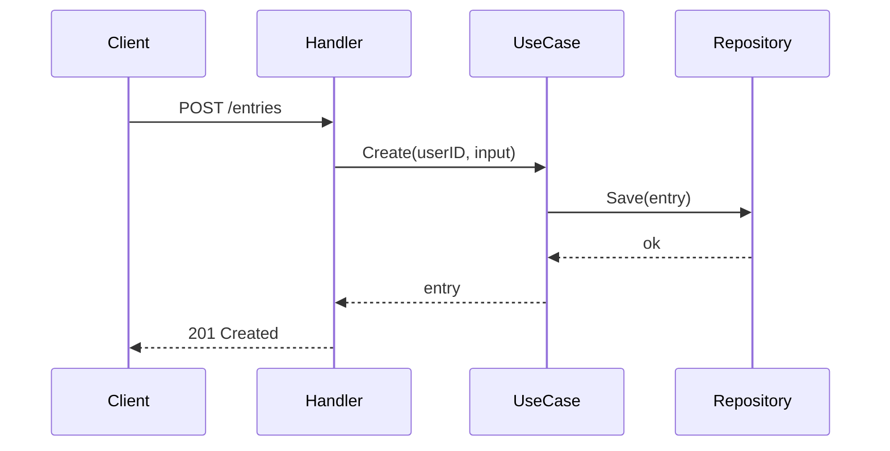

## 概要
<!-- このPRで何をしたか、1〜2文で -->

## 変更内容
<!-- 具体的な変更をリストで -->
-

## 設計判断・意思決定の理由
<!-- なぜこのアプローチにしたのか、他の選択肢との比較、トレードオフなど -->
-

## 関連issue
<!-- closes #xxx で自動クローズ -->
-

## レビュー観点
<!-- レビュアーに特に見てほしいポイント -->
-

## フロー図 / 図解（任意）
<!--
複数レイヤーをまたぐ変更、状態遷移、外部 API 連携、データフローの変更などは
Mermaid 図やシーケンス図を入れるとレビューが圧倒的に楽になります。
毎回は不要ですが、文章で説明しにくいときに活用してください。

例:

-->

## テスト
- [ ] `go build ./...` 通過
- [ ] `go vet ./...` 通過
- [ ] `go test ./...` 通過
