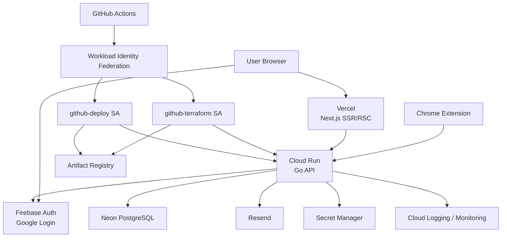

# 公開βインフラ・認証・DB設計

Status: accepted for beta
Created: 2026-06-08

## 目的

本ドキュメントは、就活管理SaaSの公開βに向けたインフラ、認証、DB、CI/CD方針を整理する。

公開βでは、運用コストを抑えつつ、一般ユーザーが実際に触れる状態までリリースすることを優先する。Cloud SQLやECS/Fargateのような本格運用向けの固定費・運用負荷が高い選択肢は、初期βでは避ける。

## 最終構成

```text
Frontend:           Vercel
Framework:          Next.js 16 / App Router / SSR / RSC / Server Actions
Backend:            Go API on Cloud Run
Auth:               Firebase Auth / Google Login only
Database:           Neon PostgreSQL
Container Registry: Artifact Registry
Secrets:            Secret Manager
Logs:               Cloud Logging
Metrics:            Cloud Monitoring
CI/CD:              GitHub Actions
IaC:                Terraform
Mail:               Resend
Extension:          Chrome Web Store
```

## 全体構成



## Frontend

FrontendはVercelにデプロイする。

このプロダクトの多くのページはNext.js App RouterのRSC/SSR/Server Actionsを使う。静的HTMLをS3やCloud Storageに置いて配信するSPA構成ではなく、Next server runtimeが必要になる。

Vercelを採用する理由:

- Next.jsのSSR/RSC/Server Actionsとの相性が最もよい
- Preview DeploymentsとRollbackが強い
- 静的アセット配信、Next server runtime、Edge/CDNまわりをVercel側に任せられる
- 初期βではCloud RunでNext serverを自前運用する必要性が低い

Cloud RunでFrontendを運用する場合は、Next.jsをコンテナ化してCloud Run上でNode serverとして起動する構成になる。可能ではあるが、Vercelと比べて運用するものが増えるため、公開βでは採用しない。

## Backend

BackendはGo APIをCloud Runにデプロイする。

Cloud Runを採用する理由:

- Dockerイメージをそのままデプロイできる
- Scale to Zeroにより低トラフィック時のコストを抑えやすい
- Artifact Registry、Secret Manager、Cloud Logging、Cloud Monitoringとの統合が自然
- Firebase Authをすでに使っているため、GCPに寄せるメリットがある

Cloud RunのHTTP endpointはpublicにする。ただし、DBを公開するわけではない。API入口は公開されるが、アプリケーション層でFirebase session cookieを検証し、ログインユーザーの所有リソースだけ操作できるように認可する。

管理系endpointを追加する場合は、通常APIとは分けるか、Cloud Run IAM認証などを使って制限する。

## Auth

認証はFirebase Authを使い、Google Login onlyとする。

Firebase Authが担当するもの:

```text
認証
誰なのかを確認する
```

Backendが担当するもの:

```text
認可
そのユーザーが対象リソースを操作できるか確認する
```

例:

```text
entry_id=123 を更新する
↓
Firebase Authで user_id を特定する
↓
Go Backendが PostgreSQL 上の所有者を確認する
↓
ログインユーザーのEntryなら更新する
```

Firebase Authを採用する理由:

- パスワードを自前で持たない
- パスワードリセット、メール認証、漏洩対応の責務を避ける
- 就活生はGoogleアカウント所持率が高い
- 将来的なGmail連携、Google Calendar連携と相性がよい

Supabase Authも実現可能だが、今回の構成ではFirebase AuthとGo Backendがすでに存在する。Supabaseの強みであるAuth、Storage、Realtime、Edge Functionsをほぼ使わないため、公開βではFirebase Authを継続する。

### Firebase redirect login

FrontendはVercelでホストしているため、Firebase Hosting上の `*.firebaseapp.com` とはoriginが異なる。Firebase Web SDKの `signInWithRedirect()` は認証helperでFirebase Hostingドメインを使うため、`authDomain` を `job-hunting-saas.firebaseapp.com` のままにすると、Chrome M115以降やスマホブラウザのthird-party storage制限でredirect結果を回収できないことがある。

そのため本番では、Firebase SDKの `authDomain` をアプリの同一ドメインに寄せる。

```text
NEXT_PUBLIC_FIREBASE_AUTH_DOMAIN=entre.kamiriku.com
```

ただし実体のFirebase認証helperはFirebase Hosting側にあるため、Next.jsで以下をrewriteする。

```text
https://entre.kamiriku.com/__/auth/*
  -> https://job-hunting-saas.firebaseapp.com/__/auth/*
```

このrewriteは302 redirectではなくproxyとして動かす。ブラウザからは `entre.kamiriku.com` の同一originに見える必要がある。

## Cookie / CORS / CSRF

FrontendとBackendは別hostになる。

```text
Frontend: entre.kamiriku.com
Backend:  api.entre.kamiriku.com
```

Next.js SSR側でsession cookieを参照するため、Backendは必要に応じて親ドメインCookieを発行できる必要がある。

公開βではセキュリティを優先し、Web session cookieは `SameSite=Strict` を採用する。

```text
Domain=.entre.kamiriku.com
HttpOnly=true
Secure=true
SameSite=Strict
```

`SameSite=Strict` では、メール、Slack、検索結果など外部サイトから `entre.kamiriku.com` に直接遷移した初回リクエストでcookieが送られない可能性がある。これはセキュリティ上は許容し、必要であれば `/auth/continue?next=...` のような同一site内再遷移ページで吸収する。

Chrome Extensionは、content scriptから直接APIを叩かず、popupまたはbackground service workerから `credentials: include` でAPIを呼ぶ。Chrome拡張は対象hostへの `host_permissions` を持つ場合、拡張から対象hostへのネットワークリクエストがSameSite上same-siteとして扱われ、`SameSite=Strict` cookieを送れるケースがある。公開βではこの方式を検証する。

許可するOriginの例:

```text
https://entre.kamiriku.com
chrome-extension://<store-extension-id>
```

実装TODO:

- `COOKIE_DOMAIN=.entre.kamiriku.com` をBackendに追加する
- `COOKIE_SECURE=true` を本番で有効化する
- `COOKIE_SAME_SITE=strict` を本番で設定する
- CORS allowlistを環境変数で管理する
- 状態変更系APIでOrigin検証またはCSRF対策を入れる
- Chrome Extensionの `host_permissions` に `https://api.entre.kamiriku.com/*` を追加する
- Chrome ExtensionのAPI送信はpopup/background service worker経由に限定する

## Database

DatabaseはNeon PostgreSQLを採用する。

候補:

```text
Neon
Supabase
Cloud SQL
```

公開βの要件:

- 安い
- 運用が軽い
- PostgreSQLを使える
- Go Backendから接続できる
- MigrationやPreview環境を作りやすい

Neonを採用する理由:

- PostgreSQL特化で、今回のGo Backend構成に合っている
- Serverless / Scale to Zero寄りで、公開βの低トラフィックと相性がよい
- Poolerがある
- BranchingによりPRごとのDBやMigration検証に使いやすい
- Firebase Auth、Cloud Run、Go Backendと役割が被らない

Supabaseを採用しない理由:

- Supabase Auth、Storage、Realtime、Edge Functionsをほぼ使わない
- 今回はDBとしてしか使わないため、Neonの方が役割が明確
- 認証はFirebase Authを継続するため、Supabase Authへの移行メリットが小さい

Cloud SQLを採用しない理由:

- GCP内Private IPやIAM統合は魅力だが、固定費が公開βには重い
- 個人開発の初期リリースでは、DBコストが運用継続リスクになりやすい

## DB接続

`DATABASE_URL` はSecret Managerで管理する。

```text
Cloud Run起動
↓
Secret ManagerからDATABASE_URLを取得
↓
pgxpoolを生成
↓
リクエスト時にpoolから接続を取得
↓
SQL実行
↓
poolへ返却
```

Connection Poolはgoroutineではなく、DB接続の集合である。

例:

```text
MaxConns=10
UserA -> conn1
UserB -> conn2
UserC -> conn3
```

`MaxConns` を超えるリクエストは、アプリ側で接続が空くまで待機する。一方で、DB本体の `max_connections` を超えると接続失敗になる。

公開βでは、Cloud Runの最大インスタンス数、pgxpoolの `MaxConns`、Neon側の接続上限を合わせて設計する。

## Pooler

PoolerはアプリとPostgreSQLの間に入り、実DB接続数を抑える。

```text
App
↓
Pooler
↓
PostgreSQL
```

例:

```text
500 requests
↓
Pooler
↓
actual DB connections: 20
```

NeonのPoolerを利用することで、Cloud Runのスケールアウト時にDB接続数が増えすぎるリスクを下げる。

## TLS

Cloud RunからNeonへの通信はTLSを使う。

TLSなしの場合、ネットワーク上でDBパスワード、SQL、個人情報が盗聴されるリスクがある。

本番では `sslmode=require` または `verify-full` を使う。証明書検証まで含められるなら `verify-full` が望ましい。

## IP制限とVPC

初期βではVPCは必須ではない。

Vercel、Neon、Firebase、Resendを使う構成では、Cloud Runから外部マネージドサービスのpublic endpointへTLSで接続する形になる。

固定egress IPやDB側のIP allowlistを使う場合は、Cloud RunからVPCへ出し、Cloud NATに固定IPを付ける構成を追加する。

初期β:

```text
Cloud Run
↓ public endpoint + TLS
Neon
```

将来:

```text
Cloud Run
↓ VPC egress
Cloud NAT static IP
↓ allowlist
Neon
```

ただし、Cloud NATやVPC構成は固定費と運用対象が増えるため、公開βでは必須にしない。

## DBユーザー分離

本番DBではruntime userとmigration userを分ける。

```text
runtime_user:
  SELECT
  INSERT
  UPDATE
  DELETE

migration_user:
  CREATE
  ALTER
  DROP
  migration table update
```

アプリケーション実行時のDBユーザーにDDL権限を持たせない。侵害時の被害範囲を小さくするため。

## Migration

MigrationはAPI起動時に自動実行しない。

推奨:

- Cloud Run JobまたはGitHub Actionsから手動承認付きで実行する
- migration userを使う
- migration tableを持つツールを使う
- 本番適用前にPreview DBまたはstaging DBで検証する

候補:

```text
goose
golang-migrate
atlas
```

公開βでは、既存SQLを本番Migrationとして安全に流せる形へ整理する必要がある。

## CI/CD

GitHub Actionsを使う。

CIとCDは分離する。

CI:

```text
test
lint
build
docker build
terraform fmt
terraform validate
terraform plan
```

CD:

```text
push to main (backend/** 変更時に自動実行)
workflow_dispatch (rollback / 任意タグ再デプロイ用、要確認入力)
docker push to Artifact Registry
deploy to Cloud Run
smoke test /health
```

Terraform:

- `fmt`
- `validate`
- `plan`

をCIで実行する。

`terraform apply` は初期βでは自動実行しない。本番反映は手動承認後に行う。

## OIDC / Workload Identity Federation

GitHub ActionsからGCPへはService Account Keyを使わない。

採用:

```text
GitHub Actions
↓ OIDC
Workload Identity Federation
↓
GCP Service Account
```

メリット:

- 長期秘密鍵をGitHub Secretsに置かなくてよい
- Repository、branch、environment単位で権限を縛れる
- キー漏洩リスクを下げられる

## IAM

Service Accountは役割ごとに分ける。

```text
sa-cloudrun-backend-runtime
sa-cloudrun-migrator
sa-github-terraform
sa-github-deploy
```

`sa-cloudrun-backend-runtime`:

- Secret Managerの必要なsecretだけ読める
- Artifact RegistryやCloud Run管理権限は持たない
- Firebase Admin SDKに必要な最小権限だけ持つ

`sa-cloudrun-migrator`:

- Migration用DATABASE_URLを読める
- Migration Job実行に必要な権限を持つ

`sa-github-terraform`:

- Terraform plan/applyを実行する
- tfstate用GCS bucketを読める/書ける
- GCPリソース作成・IAM変更・API有効化に必要な権限を持つ
- アプリデプロイ用workflowからは使わない

`sa-github-deploy`:

- Artifact Registryへpushできる
- Cloud Runへdeployできる
- runtime service accountをactAsできる
- Terraform plan/apply用の強い権限は持たない

## Logging / Monitoring

Cloud RunのログはCloud Loggingへ送る。

Backendでは構造化ログを使う。

含めるもの:

```text
request_id
method
path
status
duration_ms
user_id_hash
error_kind
```

含めないもの:

```text
session cookie
Authorization header
DB password
Firebase token
email address
company memo
full URL with query
```

Alert候補:

- 5xx rate
- p95 latency
- panic log
- DB connection failure
- Firebase verification failure surge
- Resend send failure
- Cloud Run deploy failure
- GCP budget alert

## Cost Operation

公開βでは自動停止よりも、まずBudget alertと人間による止血手順を優先する。

初期予算:

```text
Monthly budget: 1000 JPY
Thresholds: 50%, 80%, 100%, forecasted 100%
```

Budget alertは自動停止ではなく通知である。通知を受けたら、Cloud Runの公開停止、不要なArtifact Registry image削除、必要に応じたBilling unlinkの順で対応する。

詳細な手順は [Operations Runbook](./operations-runbook.md) に記載する。

## Mail

メール送信はResendを使う。

公開βで必要になりうるメール:

- 登録完了
- 重要なアカウント変更
- 締切通知
- 日次サマリ

通知メールを本格化する場合は、Cloud SchedulerからCloud Run Jobまたは保護されたHTTP endpointを呼び、Resendで送信する。

通知のON/OFF、unsubscribe、送信ログは早めに設計する。

## Chrome Extension Release

開発者モードは開発・自己利用には十分だが、公開βではChrome Web Store配布を使う。

段階:

```text
Developer mode
↓
Chrome Web Store Private
↓
Unlisted beta
↓
Public
```

本番manifest/buildで必要なこと:

- localhostのhost permissionsを消す
- `https://api.entre.kamiriku.com/*` を許可する
- `VITE_API_BASE_URL=https://api.entre.kamiriku.com` でbuildする
- `VITE_WEB_BASE_URL=https://entre.kamiriku.com` でbuildする
- Store ID確定後、BackendのCORS allowlistに `chrome-extension://<store-extension-id>` を追加する

拡張はURL、タイトル、媒体、企業名推定結果などをBackendに送るため、Privacy Policyが必要になる。

## 不採用理由

### AWS ECS/Fargate

本格運用では標準的な選択肢だが、公開βでは構成が重い。

必要になりやすいもの:

```text
ALB
Target Group
ECS Service
Task Definition
VPC
Security Group
NAT Gateway
CloudWatch
ECR
Secrets Manager
```

個人開発の初期βでは、固定費と運用負荷がCloud Runより大きくなりやすい。

### AWS App Runner

新規採用しない。

App Runnerは新規顧客向けの提供状況や今後の機能追加に制約があるため、AWSでコンテナ運用するならECS/Fargateを前提に考える。

### Railway / Render

便利だが、Secret、IAM、Logging、MonitoringがPaaS側に隠れやすい。

公開βとしては使えるが、このプロダクトではGCP/Firebase/Cloud Runに寄せた方が、設計意図と運用責任を説明しやすい。

### Cloud SQL

GCP内Private IPやIAM統合は強いが、固定費が高い。

公開βではNeonを採用し、利用状況や売上見込みが見えてからCloud SQL移行を検討する。

## 実装TODO

Terraform:

- bootstrap apply
- GitHub repo variables設定
- prod plan / apply
- Cloud Run service有効化
- Cloud Run domain mapping有効化
- Cloud Logging / Monitoring alert
- Budget alert

Backend:

- `COOKIE_DOMAIN` を設定可能にする
- CORS allowlistを環境変数化する
- Origin検証またはCSRF対策を追加する
- pgxpoolの `MaxConns` を環境変数化する
- 構造化ログとrequest_idを入れる
- Firebase Admin SDKの本番設定を確認する

Database:

- Neon project/database作成
- runtime user / migration user分離
- TLS接続設定
- Pooler接続URL確認
- Backup / restore確認
- Migration tool選定
- Migration実行手順作成

CI/CD:

- GitHub ActionsからOIDCでGCP認証
- Docker image build
- Artifact Registry push
- Cloud Run deploy
- `/health` smoke test
- Terraform fmt / validate / plan
- protected environmentとmanual approval設定

Chrome Extension:

- production manifestからlocalhost権限を除外
- production API/Web URLでbuild
- Chrome Web Store developer登録
- PrivateまたはUnlisted配布
- Privacy Policy作成
- Store IDをBackend CORSに追加

## 現時点の結論

公開βとしては、以下の構成で進める。

```text
Vercel
↓
Cloud Run
↓
Neon PostgreSQL

Auth: Firebase Auth
Secrets: Secret Manager
Registry: Artifact Registry
Logs: Cloud Logging
Metrics: Cloud Monitoring
CI/CD: GitHub Actions + Workload Identity Federation
IaC: Terraform
Mail: Resend
```

ここから先はクラウド選定ではなく、実装フェーズである。

優先して詰めるべきものは、Cookie/CORS/Auth、Migration、CI/CD、Logging、Chrome Extension releaseである。
