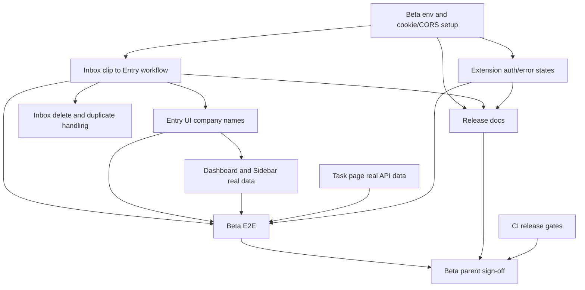

# Entré beta release plan

Status: active
Created: 2026-05-28

## Goal

Beta release means the simplified web core workflow is usable end to end:

1. A user signs in with Google on the web app.
2. The user has a saved recruiting page in the web Inbox.
3. The clip is persisted in PostgreSQL with the signed-in user.
4. The clip appears in the web Inbox.
5. The user turns the clip into an Entry and can manage it in Entry/Kanban/Task views.

The Chrome extension remains an optional input accelerator for beta sign-off, not the main product surface. This plan intentionally does not include a public Chrome Web Store release or full formal-release scope such as email notifications, data export, account deletion, roadmap, Gmail, or Calendar integrations.

## Current State

Confirmed working:

- Google login is wired through Firebase session cookies.
- `POST /api/v1/inbox/clips` persists extension clips by authenticated user.
- `/inbox` can display persisted clips for the logged-in user.
- Core backend CRUD exists for Company, Entry, Task, StageHistory, InboxClip.
- Chrome extension popup can save to the Inbox API.
- The authenticated app shell now focuses on Home, Entry, Kanban, Task, and Inbox.

Quality pass completed in the current branch:

- Chrome extension save success now keeps the popup open and points users to Web Inbox.
- Chrome extension extraction now uses JSON-LD, site-specific DOM selectors, meta title, and page title fallbacks instead of only the first heading.
- Inbox clip conversion copy explains that Company + Entry are created and Entry/Kanban/Task become available.
- Inbox clip conversion can now reuse an existing Company candidate instead of always creating a duplicate Company.
- Entry, Kanban, Task, Inbox, Profile, Dashboard, and Sidebar no longer rely on fake student profile/streak copy in the core app shell.
- Empty states now point to the next concrete action instead of ending at a blank list.
- Kanban stage update failures surface a visible error instead of silently rolling back.
- Task page can now create deadline/schedule tasks directly by selecting an Entry.
- Task page now sorts tasks by actionable order and can delete tasks without leaving the page.
- Entry detail can now create, complete, and delete tasks in the company context.
- Dashboard, Sidebar, Profile, and Roadmap have been simplified so non-core surfaces no longer compete with Entry/Kanban/Task/Inbox.

Known gaps:

- Authenticated browser E2E covers the web core flow with a mock API, but not the real Chrome extension/Firebase/PostgreSQL combination.
- Task editing still requires deeper per-task controls; Task creation/completion/deletion now works from Task page and Entry detail.
- New-company Entry creation still creates Company then Entry via two API calls; backend transaction/dedicated conversion endpoint remains issue #62.
- Extension extraction is still client-side heuristic extraction and can miss company names on unsupported page layouts.
- Local/beta environment setup is under-documented.
- There is no single automated beta E2E proving extension-save-to-entry-management.

## Scope Boundaries

### In Beta

- Inbox clip to Entry workflow.
- Real-data web views for the beta path.
- Home / Entry / Kanban / Task / Inbox as the only core app surfaces.
- Extension save reliability and clear user-facing error states as optional input support.
- Environment documentation for Firebase, CORS, Cookie, and extension ID.
- Release-gate tests and CI coverage for backend, frontend, and extension.

### After Beta

- Email notifications.
- CSV export.
- Account deletion and full data purge.
- Roadmap and long-term planning views.
- Gmail / Google Calendar integrations.
- Chrome Web Store public listing.
- Privacy policy/store assets.
- Advanced duplicate merge and company alias management.

## Dependency Graph

## Issue Plan

### P0: Beta Release Blockers

1. #91 `feat: Inbox clip から Entry を作成する整理導線を追加する`
   - Depends on: authenticated Inbox API, Company/Entry create APIs.
   - Enables: beta core flow, beta E2E.
   - Related existing issue: #62.

2. #92 `feat: Entry系画面で会社名を表示できるようにする`
   - Depends on: Entry list/detail data model decision.
   - Enables: Entry list, Kanban, detail pages to feel like a real product.

3. #93 `fix: Dashboard と Sidebar の固定表示を実データに置き換える`
   - Depends on: Entry/Inbox real data availability.
   - Enables: beta users to trust counts and overview.

4. #94 `feat: Task画面を実APIデータで表示・更新できるようにする`
   - Depends on: existing Task API.
   - Enables: deadline/task management to stop being demo-only.

5. #95 `feat: Chrome拡張の未ログイン・保存失敗時の案内を整える`
   - Depends on: beta environment cookie/CORS setup.
   - Enables: beta users to recover from 401/CORS/API failures.
   - Related existing issue: #61.

6. #96 `chore: β環境のFirebase/CORS/Cookie/拡張ID設定をドキュメント化する`
   - Depends on: current working local setup.
   - Enables: reproducible beta testing.

7. #97 `test: 拡張保存からEntry管理までのβE2Eを追加する`
   - Depends on: issues 1 through 6.
   - Enables: release sign-off.

### P1: Beta Quality

8. #98 `feat: Inbox clip の削除と重複URLの最低限対応を追加する`
   - Depends on: Inbox list UI.
   - Enables: cleanup and repeated-save safety.
   - Related existing issues: #60, #61.

9. #99 `ci: backend/frontend/chrome-extension のβリリースゲートを揃える`
   - Depends on: current CI workflows.
   - Enables: every PR to prove the beta path still builds/tests.
   - Related existing issues: #71, #75, #76.

10. #100 `docs: READMEと要件/開発ステータスを現在のβ構成に更新する`
    - Depends on: beta scope decisions.
    - Enables: onboarding and issue execution without stale docs.

### P2: Formal Release Track

Existing formal-release issues should remain separate from beta:

- #101 Chrome Web Store公開前のprivacy policyとストア素材準備.
- #35 account deletion.
- #37 CSV export.
- #38 email notifications.
- #56 revoked session handling.
- Chrome Web Store listing, privacy policy, and store assets need a new formal-release issue when beta stabilizes.

## Implementation Notes

### Inbox Clip to Entry

Preferred first implementation:

- Add a client component under `frontend/src/components/entre/` or local to `frontend/src/app/inbox/`.
- Use `clip.guess` as initial company name.
- Use `clip.source` as initial source.
- Use `本選考` as the default route.
- Use memo content containing title and URL.
- On success:
  - create Company,
  - create Entry,
  - delete InboxClip,
  - revalidate `/inbox`, `/entry`, `/dashboard`, `/kanban`,
  - navigate to the created Entry detail if the action can return the Entry ID; otherwise `/entry`.

If orphan company risk becomes painful, resolve existing issue #62 by moving Company + Entry creation into a backend transaction or dedicated endpoint.

### Company Names in Entry UI

Short-term options:

- Fetch Companies and map `companyId -> name` in frontend server resources.
- Or extend Entry API response to include `companyName`.

For beta, prefer the smallest stable path. If multiple pages need company names, extending the backend response may reduce repeated frontend fetching.

### Hardcoded Data Removal

Hardcoded/demo data to address before beta:

- `frontend/src/app/dashboard/page.tsx`: `QUESTS`, streak, fixed encouragement copy.
- `frontend/src/components/entre/Sidebar.tsx`: fixed counts `24`, `9`, `2`, streak card.
- `frontend/src/app/task/page.tsx`: `INITIAL_TASKS`.

## Test Plan

Backend:

- `go test ./...`
- Existing InboxClip handler/usecase/repository tests remain green.
- Add tests if API response shape changes for company names.

Frontend:

- `pnpm test`
- Component tests for Inbox conversion form:
  - renders clip defaults,
  - validates missing company name,
  - creates company and entry,
  - deletes clip after success,
  - shows API error without deleting clip.
- Component/server-resource tests for company name mapping if implemented frontend-side.

Chrome extension:

- `pnpm build`
- Add unit-level coverage if the project introduces a test runner for extension logic.
- Manual beta smoke:
  - logged out save shows login guidance,
  - logged in save creates a clip,
  - unsupported site still saves URL/title/source fallback.

E2E:

- Authenticated user can see Inbox.
- A seeded or API-created InboxClip appears in `/inbox`.
- User converts the clip to Entry.
- Clip disappears from `/inbox`.
- Entry appears in `/entry` and `/kanban`.

## Release Gates

Beta can be tagged when:

- P0 issues are closed.
- `go test ./...` passes.
- `frontend pnpm test` and build pass.
- `chrome-extension pnpm build` passes.
- Beta E2E passes locally and in CI, or manual sign-off is documented if CI auth is not ready.
- README contains a working beta setup path for backend, frontend, and extension.
